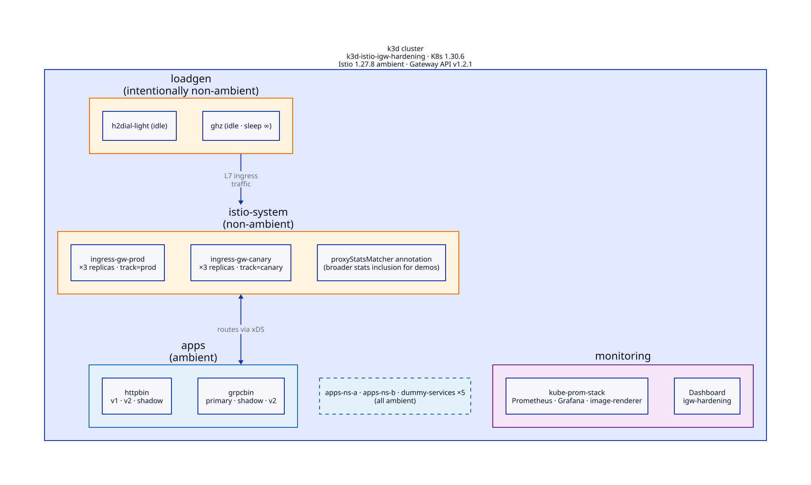

# Istio Ingress Gateway Hardening Playground

A k3d-based reproducer and walkthrough of how to roll out Istio
`Gateway`, `VirtualService`, `HTTPRoute`, and `GRPCRoute` changes
safely. Nineteen runnable demonstrations cover the mechanisms; this
README explains what each one proves and why it matters.

It's written for engineers comfortable with Kubernetes and some Istio
who haven't yet thought carefully about why a `kubectl apply` to a
`VirtualService` can take an ingress down, and what to do about it.

## Contents

1. [What problem is this?](#what-problem-is-this)
2. [The five-phase framework](#the-five-phase-framework)
   - [Phase 1 — Prevent](#phase-1--prevent)
   - [Phase 2 — Limit](#phase-2--limit)
   - [Phase 3 — Validate](#phase-3--validate)
   - [Phase 4 — Recover](#phase-4--recover)
   - [Phase 5 — Gateway-pod resilience](#phase-5--gateway-pod-resilience)
3. [Protocol applicability](#protocol-applicability)
4. [A note on API choice (classic Istio vs Gateway API)](#a-note-on-api-choice-classic-istio-vs-gateway-api)
5. [Quick start](#quick-start)
6. [Prerequisites](#prerequisites)
7. [Topology](#topology)
8. [Demo matrix](#demo-matrix)
9. [OSS Istio ↔ SEfI install command swap](#oss-istio--sefi-install-command-swap)
10. [Operational metrics + manual snapshots](#operational-metrics--manual-snapshots)
11. [Iteration findings worth knowing](#iteration-findings-worth-knowing)
12. [Iteration risks specific to Istio 1.27.8](#iteration-risks-specific-to-istio-1278)
13. [Further reading](#further-reading)
14. [Cleanup](#cleanup)
15. [Files](#files)

---

## What problem is this?

When you change a `Service`'s Deployment in Kubernetes, the rollout is
gradual: the replica set spins up new pods, runs health checks, and
gracefully replaces the old ones. A bad config in the new image surfaces
in the new pods only, and the rollout pauses or rolls back when health
checks fail.

When you change an Istio `Gateway`, `VirtualService`, or
`gateway.networking.k8s.io/HTTPRoute`, that is **not** what happens.
Istio's control plane (`istiod`) processes the CRD change and pushes the
resulting configuration to every Envoy proxy whose labels match the
resource's selector. There is no "rolling configuration update." There
is no health check on the configuration itself. A malformed routing
rule, a TLS setting with a missing credential reference, a destination
pointed at a Service that doesn't exist — istiod accepts it (mostly;
we'll qualify that shortly), generates the corresponding xDS payload,
and pushes it to every gateway pod at once.

If you've staged your gateway pod deployment so that the new image rolls
out at the same time as the new CRD configuration, two distinct things
happen in parallel:

1. Kubernetes performs a rolling update of the gateway pod Deployment.
   Gradual. Reversible. Health-check-gated.
2. Istio processes the new `Gateway`/`VirtualService`/`HTTPRoute` CRDs
   and pushes the new configuration to **every** matching gateway proxy
   simultaneously. Atomic from the cluster's perspective. Not
   health-check-gated. Not reversible without another CRD apply.

The blast radius of a bad configuration change is therefore "every
gateway pod that matches the resource's selector, as soon as istiod
processes the apply." For a typical single-tier ingress deployment, that
means "every gateway pod, in seconds, in production." For teams
operating behind a load balancer that distributes by connection rather
than by request (any L4 LB — AWS NLB, GCP TCP load balancer, on-prem F5),
this surface manifests as: every client whose connection happens to
terminate on any gateway pod sees the new (potentially bad)
configuration on its next request.

The framework below is about reducing that blast radius without slowing
the team down. It has five phases:

1. **Prevent** — gates that block a bad CRD from landing in the cluster
   at all.
2. **Limit** — scoping mechanisms that confine a bad CRD to a subset of
   gateway pods, so it never reaches the full fleet.
3. **Validate** — real-traffic-subset techniques that let you exercise a
   candidate configuration against production payloads before promoting.
4. **Recover** — observability and tooling for "did the change actually
   land" and "did the revert actually take effect."
5. **Resilience** — the properties of the gateway pod itself that
   determine what happens when a bad configuration does arrive.

Defense in depth: no single mechanism is sufficient. Each layer is
cheap to get right; skipping a layer leaves you exposed to the class
of failure it was meant to prevent.

---

## The five-phase framework

### Phase 1 — Prevent

The cheapest configuration change to fix is the one that never lands
in the cluster. Three gates compose, each catching a different class
of problem.

**The Istio validating admission webhook.** When you install Istio, it
registers a `ValidatingWebhookConfiguration` that routes `CREATE` /
`UPDATE` operations on `networking.istio.io`, `security.istio.io`,
`telemetry.istio.io`, and `extensions.istio.io` resources through
istiod's `/validate` endpoint. Schema violations are rejected before the
resource is persisted to etcd. A `VirtualService` with `port.protocol:
BOGUS` will never reach the data plane.

**Critical caveat:** the webhook validates **one object at a time**. It
does not have visibility into cross-resource references. A
`VirtualService` whose `destination.host` points at a Service that
doesn't exist in the cluster is **accepted** by the webhook, persisted
to etcd, and pushed to every gateway proxy whose selector includes it.
Envoy will then 503 every request matching that route at runtime. This
is documented upstream behavior (see
[istio/istio#55390](https://github.com/istio/istio/issues/55390) for an
issue where a user noticed and a maintainer confirmed the design).

Once healthy, the webhook fails closed: if istiod is down, new CRD
writes are rejected rather than admitted blindly. That's worth
remembering during incidents, because a degraded istiod blocks every
`networking.istio.io` write across the cluster.

> **Demo:** `phase1-prevent/01-validating-webhook.sh`. Applies a
> schema-invalid VirtualService (negative `weight`) and observes
> rejection. Then applies a VirtualService with a dangling destination
> reference and observes that the webhook **accepts** it, confirming
> the per-object-only limitation.

> **See also:** [Istio: Configuration Validation Problems](https://istio.io/latest/docs/ops/common-problems/validation/).

**`istioctl analyze` in CI.** `istioctl analyze` runs a separate static
analysis pass over a directory of rendered manifests. Unlike the
webhook, it does cross-resource reference checking: dangling
`destination.host` values surface as `IST0101`
(`ReferencedResourceNotFound`); missing gateway selectors surface as
`IST0110` and friends; the full `IST0xxx` analysis-message family covers
most of the common configuration-graph problems.

Used as a CI gate over rendered Helm/Kustomize output, this catches the
dangling-reference class before the apply happens. Exit code is
non-zero when errors are present, so pipeline integration is trivial.

**The webhook and `analyze` are different gates with different
scopes.** Run only the webhook and the dangling-reference class slips
through. Run only `analyze` in CI and any human with `kubectl apply`
privileges can introduce dangling refs directly in production. The
defensible posture runs both.

> **Demo:** `phase1-prevent/02-istioctl-analyze.sh`. Runs `istioctl
> analyze` against a manifests file with a dangling reference. Verifies
> non-zero exit and that the output specifically names IST0101.
> Cross-asserts the gap by showing the webhook would still accept the
> same file.

> **See also:** [Istio: Diagnose your Configuration with Istioctl Analyze](https://istio.io/latest/docs/ops/diagnostic-tools/istioctl-analyze/).

**ValidatingAdmissionPolicy for team-specific invariants.** Kubernetes
1.30+ ships `ValidatingAdmissionPolicy` (VAP) with CEL expressions,
enforced by the kube-apiserver alongside (or instead of) the Istio
webhook. This is the right home for invariants that are team-specific
and not in the upstream Istio validation surface:

- "No `Gateway.spec.servers[*].hosts` may contain `'*'`."
- "Every gateway-bound `VirtualService` must set `exportTo: ['.']` or
  `exportTo: ['namespace/']`."
- "`Gateway.spec.selector` must include a `track:` label so prod and
  canary are always distinguishable."
- "An `HTTPRoute` `backendRefs[*].weight` may not change by more than
  50% in a single PR."

None of these belong in the Istio webhook (which doesn't know your
team's conventions), and all of them are verifiable at admission time
without the rest of the analysis tool's machinery.

One subtlety: the Gateway API CRD's built-in schema regex on
`Gateway.spec.listeners[*].hostname` already blocks the literal `'*'`,
so a VAP rule of "no hostname = `'*'`" never triggers — the CRD catches
it first. The realistic Gateway API rule is "every listener must set
a non-empty hostname," which catches the semantically equivalent case
where an omitted hostname matches any host.

> **Demo:** `phase1-prevent/03-validating-admission-policy.sh`. Applies
> two VAPs (one for classic Istio Gateway, one for Gateway API Gateway),
> tries to apply violating resources, verifies rejection citing the
> policy name.

> **See also:** [Kubernetes: ValidatingAdmissionPolicy](https://kubernetes.io/docs/reference/access-authn-authz/validating-admission-policy/).

**What "Prevent" doesn't catch.** These gates address the
configuration-text problem. They don't catch:

- A configuration that's textually valid but **semantically wrong for
  your runtime** — say, a `VirtualService` whose route order
  inadvertently shadows an existing route.
- A configuration where the **target backend parses fine but is
  operationally broken** — say, a healthy Service whose pods carry
  a regex that explodes vhost cardinality and OOMs the gateway. The
  config parses; the gateway dies anyway.

Phases 2 and 3 cover both cases.

### Phase 2 — Limit

When a bad CRD does land, the goal is to contain it to a subset of
the gateway fleet — a slice small enough that the team can absorb the
blast without affecting production users.

**Selector-scoped Gateway pair.** The Istio `Gateway` resource's
`spec.selector` field is a workload selector: istiod pushes the
configuration for that Gateway to every gateway pod whose labels match.
The default deployment pattern uses a single label (`istio:
ingressgateway`) on a single Deployment with N replicas, and a single
Gateway selecting all of them. A bad CRD bound to this Gateway reaches
all N pods.

The hardening pattern is **two gateway Deployments with disjoint
labels** and **two Gateway resources whose `spec.selector` targets each
set independently**:

```yaml
# Production gateway pods carry track=prod
metadata: { labels: { app: ingress-gw, track: prod } }

# Canary gateway pods carry track=canary
metadata: { labels: { app: ingress-gw, track: canary } }

# Production Gateway selects only the prod track
spec: { selector: { app: ingress-gw, track: prod } }

# Canary Gateway selects only the canary track
spec: { selector: { app: ingress-gw, track: canary } }
```

Routing resources (`VirtualService` via `spec.gateways`,
`HTTPRoute` / `GRPCRoute` via `spec.parentRefs`) bind to one Gateway or
the other. A `VirtualService` bound to `canary-gateway` will reach
**only** canary-track pods. A bad rule in that VS does not affect the
prod track.

Combined with an upstream traffic split — typically managed by the load
balancer in front of the gateway, e.g., AWS NLB weighted target groups —
this gives you blast-radius reduction proportional to the canary
weight.

The Gateway API equivalent is structurally different but achieves the
same result. With `gatewayClassName: istio`, Istio auto-provisions a
backing Deployment for each `Gateway` resource. Two Gateway resources
(prod and canary) yield two backing Deployments.
`HTTPRoute.parentRefs` binds a route to one Gateway and therefore to
its backing Deployment.

> **Demos:**
> - `phase2-limit/05-selector-scoped-gateway-pair-istio.sh` — classic API
> - `phase2-limit/05-selector-scoped-gateway-pair-gwapi.sh` — Gateway API

> **See also:** [Istio: Gateway reference](https://istio.io/latest/docs/reference/config/networking/gateway/); [Kubernetes Gateway API: Gateway resource](https://gateway-api.sigs.k8s.io/api-types/gateway/).

**`exportTo` for cross-namespace visibility.** The selector pair limits
which **pods** see a CRD. `exportTo` limits which **namespaces** can
see a CRD. By default, a `VirtualService`, `DestinationRule`, or
`ServiceEntry` is visible to all namespaces; any gateway pod in any
namespace can pick it up if its `spec.gateways` binding references it.

```yaml
spec:
  exportTo: ["."]      # only this namespace
  # or
  exportTo: ["ns-a", "ns-b"]    # named namespaces only
```

This is a defensive narrowing on top of selector scoping. Gateway API
does not have a direct equivalent on the route side; the closest
analogue is `Gateway.spec.listeners[*].allowedRoutes.namespaces`, which
is a Gateway-side control rather than a route-side control.

> **Demo:** `phase2-limit/06-exportto.sh`. Toggles `exportTo` between
> `["*"]` and `["."]` and observes the route appearing and disappearing
> on the canary pod.

> **See also:** [Istio: Configuration Scoping](https://istio.io/latest/docs/ops/configuration/mesh/configuration-scoping/).

**`PILOT_FILTER_GATEWAY_CLUSTER_CONFIG`.** The Envoy configuration that
istiod sends to a gateway proxy includes, by default, a `Cluster` entry
for **every** Service in the mesh — even services the gateway has no
route to. Enabling this env var on istiod restricts the clusters
pushed to a gateway pod to **only those referenced by VirtualServices
attached to that gateway**. Smaller xDS payload, smaller attack surface
for "an unrelated mesh change broke my ingress."

It's a mesh-wide setting with no per-gateway knob (see
[istio/istio#54443](https://github.com/istio/istio/issues/54443)),
but it's cheap to enable and generally a strict improvement.

> **Demo:** `phase2-limit/07-pilot-filter-gateway-cluster-config.sh`.
> Captures the canary gateway's cluster count, enables the flag,
> captures again, and verifies ≥30% reduction.

### Phase 3 — Validate

Even with prevent and limit in place, a candidate configuration can
parse fine, land only on the canary track, and still misbehave under
real traffic. Validation is the step that exercises the candidate
against real-shaped requests before promoting it to production.

**Traffic mirroring (shadow traffic).** Route 100% of traffic to the
production backend and **mirror** the same requests to a candidate
backend. The mirror is fire-and-forget — the client sees only the
production response; the candidate's response is discarded. Errors and
crashes at the candidate do not affect the client.

This catches the class of issue where the request parses fine but the
backend handler crashes on a specific shape of real production payload
— exactly the long tail that synthetic test traffic in a pre-prod
environment can't reproduce.

Mechanism support across APIs:

| API | Mechanism | Percentage support |
|----|----|----|
| Classic Istio API | `VirtualService.spec.http[*].mirror` + `mirrorPercentage` | Yes (0.0–100.0) |
| Gateway API | `HTTPRoute` / `GRPCRoute` `RequestMirror` filter | **No (100%-only)** |

The classic Istio API's percentage knob earns its keep: you can mirror
1% of production traffic to validate a new backend without doubling the
load on it. The Gateway API filter is 100%-only, so sub-sampling with
Gateway API requires an `ExtensionRef` filter or routing through a
fractional-sampling proxy.

Mirror works correctly for HTTP/1.1, HTTP/2, and gRPC. On the gRPC
path, the mirror sends a copy of the unary call to the candidate;
trailers and status codes propagate correctly, and the candidate's
response is discarded with no visible client effect.

> **Demos:**
> - `phase3-validate/08-traffic-mirroring-istio.sh` — HTTP/1.1 + classic Istio
> - `phase3-validate/08-traffic-mirroring-gwapi.sh` — HTTP/1.1 + HTTPRoute
> - `phase3-validate/08c-traffic-mirroring-grpc-istio.sh` — gRPC + classic Istio
> - `phase3-validate/08d-traffic-mirroring-grpc-gwapi.sh` — gRPC + GRPCRoute

> **See also:** [Istio: Traffic Mirroring](https://istio.io/latest/docs/tasks/traffic-management/mirroring/); [Gateway API: HTTPRouteFilter](https://gateway-api.sigs.k8s.io/reference/spec/#gateway.networking.k8s.io%2fv1.HTTPRouteFilter).

**Header-matched canary.** Where mirroring sends a copy of real
traffic, a header-matched canary routes a fraction of real traffic to
the candidate based on an HTTP header. Requests carrying `x-canary:
true` go to the candidate; everyone else stays on production.

This is the right tool when you want to exercise the candidate with
**real end-to-end behavior** — response path included — not just the
shadow-side observation. The selector can be any property of the
request: a header set by a feature-flag system, a session-affinity
cookie, an authenticated user attribute extracted by an EnvoyFilter.
Pair it with synthetic test traffic that injects the header from a CI
pipeline and you get full-fidelity validation against production.

Both APIs support this identically. The more-specific match wins; the
unmatched default rule catches everything else.

> **Demos:**
> - `phase3-validate/09-header-matched-canary-istio.sh`
> - `phase3-validate/09-header-matched-canary-gwapi.sh`

### Phase 4 — Recover

Prevent + Limit + Validate together cover the forward path. Recovery
is the reverse path: a bad change is in production, and the team needs
to confirm it's bad, push the revert, and verify the revert actually
took effect.

**Distribution tracking and `istioctl proxy-status`.** `istioctl
proxy-status` (alias `istioctl ps`) reports per-proxy xDS sync state.
For each gateway pod, it shows whether the proxy's CDS, LDS, EDS, RDS,
and WDS configurations are SYNCED, STALE, or NOT SENT relative to the
current istiod state. After applying a revert, `istioctl ps -l
app=ingress-gw,track=canary` tells you whether the revert has reached
every canary pod, in one screen.

When `PILOT_ENABLE_CONFIG_DISTRIBUTION_TRACKING=true` and
`PILOT_ENABLE_STATUS=true` are both set on istiod, istiod is documented
to write per-proxy ACK state into each resource's `.status` field
(see [istio/istio#50500](https://github.com/istio/istio/issues/50500)).
**Iteration finding:** in Istio 1.27.8 we confirmed that even with
both flags enabled, the `.status` field of a `VirtualService` remains
empty. The `proxy-status` command works and is the supported signal;
`.status`-as-distribution-tracking-surface appears to have regressed in
1.27.8.

> **Demo:** `phase4-recover/10-distribution-tracking.sh`.

> **See also:** [Istio: Debugging Envoy and istiod](https://istio.io/latest/docs/ops/diagnostic-tools/proxy-status/).

**Polling proxy-status as a CD gate.** For automated CD pipelines that
need to gate a stage on "the apply has landed," the historical answer
was `istioctl experimental wait --for=distribution`. That command was
**removed** in Istio 1.27. It no longer exists under `istioctl wait`,
`istioctl experimental wait`, or any other top-level command, and
there's no documented replacement.

The practical workaround is to poll `istioctl proxy-status` until the
output shows zero `STALE` or `NOT SENT` entries for the target gateway
pods. Demo #11 wraps this in a 30-second timeout, and the same polling
loop covers the forward apply, the candidate switch, and the revert.
Distribution to canary pods finishes in under a second on a healthy
k3d cluster, so the polling overhead is negligible.

This silent removal is the playground's most concrete upstream-feedback
finding: every Istio shop that automated `experimental wait` in its
pipeline has to adapt, and the official docs don't flag the breaking
change.

> **Demo:** `phase4-recover/11-experimental-wait-revert.sh`.

### Phase 5 — Gateway-pod resilience

The previous four phases are properties of the configuration pipeline.
The fifth is a property of the gateway pod itself: what happens to
in-flight traffic when a bad configuration does arrive despite every
other gate.

**Envoy listener warming.** Envoy's listener subsystem distinguishes
between an **active** listener (currently bound to a socket, accepting
connections) and a **warming** listener (configuration is being
applied; not yet serving traffic). When istiod pushes a new listener
configuration, Envoy creates the new listener in the warming state and
only swaps it in if it fully initializes. If the new listener fails to
bind a port, initialize TLS, or pass internal validation, the new
listener stays in warming indefinitely and **the previously-active
listener continues to serve traffic**. The customer sees "feature
didn't deploy" rather than "ingress dropped traffic."

This is default Envoy behavior — not configurable, not opt-in. A
whole class of bad listener configurations degrades gracefully without
operator intervention.

> **Demo:** `phase5-resilience/12-envoy-listener-warming.sh`. Applies a
> known-good Gateway, observes traffic. Applies a malformed Gateway on
> top. Verifies the original listener stays in `Route: http.8080` and
> serves 5/5 requests successfully.

> **See also:** [Envoy: Listener warming](https://www.envoyproxy.io/docs/envoy/latest/intro/arch_overview/listeners/listeners.html).

**xDS push and connection state.** Behind a connection-based load
balancer (any L4 LB), each TCP connection from a client is pinned to
one gateway pod for its lifetime, and subsequent requests over that
connection always reach the same pod.

When istiod pushes a CRD update to the gateway fleet, every gateway pod
receives the new configuration. The **existing connections** stay open;
the same TCP connection continues to serve subsequent requests from
that client. But those subsequent requests run against the **updated**
Envoy configuration, because Envoy looks up its route table per-request,
not per-connection.

The same behavior holds for HTTP/1.1 keep-alive, HTTP/2 (one connection
multiplexing many streams), and gRPC (HTTP/2 with the typical
real-world client pattern of holding one `grpc.ClientConn` for the
entire application's lifetime). All three protocols share the same
property: **existing connections see new routes on their next request
after an xDS push to their gateway pod**.

This runs counter to a common intuition. Operators sometimes assume
that an in-flight connection pins the routing decision at
connection-establishment time, and that long-lived connections are
therefore insulated from mid-flight configuration changes. **That
intuition is wrong for HTTP-family protocols at the L7 ingress.**

The intuition is right at the L4 layer in one narrow sense: an NLB
connection to gateway pod A stays on pod A for the connection's
lifetime, so the **gateway-pod set** the connection sees never
changes. But the routing decision is still per-request, and it always
follows whatever the gateway pod's current Envoy configuration says.

Track isolation (Phase 2, selector-scoped Gateway pair) is what gives
you connection-grain control:

- Update the **canary**-scoped VS only. The change reaches canary-track
  pods only.
- A client whose NLB connection terminated on a **prod**-track pod is
  completely unaffected by the canary VS change. Subsequent requests
  on that connection continue to use prod's routes.
- A client whose connection terminated on a **canary**-track pod sees
  the new canary VS on its next request.

This composition is the load-bearing protection for safe in-place
CRD rollouts behind an L4 load balancer. It doesn't come from
connection state; it comes from **track isolation combined with the
NLB's connection stickiness**.

> **Demos:**
> - `phase5-resilience/13-xds-push-track-isolation.sh` — HTTP/1.1 keep-alive
> - `phase5-resilience/13b-xds-push-http2-sustained.sh` — sustained HTTP/2 over one TCP connection
> - `phase5-resilience/13c-xds-push-grpc-long-lived.sh` — gRPC with a single ClientConn

> **See also:** [Envoy: xDS protocol overview](https://www.envoyproxy.io/docs/envoy/latest/api-docs/xds_protocol).

---

## Protocol applicability

The framework above applies across protocols, but the specifics vary:

| Protocol | Phase 1 (Prevent) | Phase 2 (Limit) | Phase 3 (Validate) | Phase 4 (Recover) | Phase 5 (Resilience) |
|---|---|---|---|---|---|
| HTTP/1.1 | Standard webhook + analyze + VAP | Selector pair + exportTo | Mirror + header canary | proxy-status polling | Listener warming; per-request routing |
| HTTP/2 | Same | Same | Mirror works; gRPC-equivalent mirror via filter | Same | Same; one TCP connection multiplexes many streams |
| gRPC | Same | Same | Mirror works (VS or GRPCRoute); trailers preserved | Same | Same; clients typically hold one `ClientConn` for the application's lifetime |
| TCP (passthrough) | Same | Same | Limited (no application-level mirror primitives in Istio) | Same | Different: routing decision is per-connection, not per-request. A TCP route change does not affect in-flight connections; the existing tunnel persists until the client disconnects. |

The TCP row is the interesting one. For Layer-4 routes via
`VirtualService.spec.tcp` or a `Gateway` listener with `protocol: TCP`,
the routing decision is taken at connection-establishment time and
locked in for the connection's lifetime. The "existing connections see
new routes on next request" finding from Phase 5 **does not** apply.
This cuts both ways: TCP services get connection-level isolation from
config changes for free, but you also can't shift a TCP route without
forcing client reconnects.

---

## A note on API choice (classic Istio vs Gateway API)

Several mechanisms in this playground are demonstrated against both
the classic Istio API (`networking.istio.io/v1`: `Gateway`,
`VirtualService`, `DestinationRule`) and the Kubernetes Gateway API
(`gateway.networking.k8s.io/v1`: `Gateway`, `HTTPRoute`, `GRPCRoute`).
Where the mechanism behaves identically across the two, only one demo
exists. Where the APIs diverge — selector scoping (`spec.selector`
workload-binding versus `allowedRoutes.namespaces` per-listener),
`exportTo` (Istio-only), mirror percentage support (Istio-only) — both
demos are present.

A few observations from running them side by side:

- **Routing primitives are mostly equivalent.** Both APIs cleanly
  express "route by host," "route by path prefix," "route by header
  match," and "weighted backends."
- **Scoping primitives differ structurally.** The classic API's
  `Gateway.spec.selector` is a workload selector that binds the
  Gateway resource to specific pods by label. Gateway API's
  `gatewayClassName` instead triggers istiod's controller to
  auto-provision a Deployment per Gateway resource. Different
  mechanism, same outcome for the canary-pair case — but a learning
  curve for migrators.
- **Feature parity has gaps.** `mirrorPercentage` is in
  `VirtualService.spec.mirror` and absent from `HTTPRoute` /
  `GRPCRoute` `RequestMirror` filters.

Pick the API your team will commit to operationally. Both can be made
to work for safe CRD rollouts. The classic Istio API gives you feature
breadth; the Gateway API gives you portability across mesh
implementations.

---

## Quick start

```bash
./deploy.sh        # ~3-5 min: creates k3d cluster, installs Istio 1.27.8 ambient,
                   #   Gateway API CRDs, ingress gateway pair (prod + canary),
                   #   httpbin family, grpcbin family, load-gen pods,
                   #   kube-prometheus-stack + Grafana with dashboard
./run-all.sh       # ~4-5 min: runs every demo, prints PASS/FAIL summary
./cleanup.sh       # ~10s: deletes the k3d cluster
```

Running individual demos:

```bash
./phase2-limit/05-selector-scoped-gateway-pair-istio.sh
./phase5-resilience/13c-xds-push-grpc-long-lived.sh
./run-all.sh 08c 09a            # run a specific subset
./run-all.sh phase3-validate    # run a phase's demos only
```

**Tunables** (environment variables, all optional):

- `INGRESS_HTTP_PORT` (default `18080`) / `INGRESS_HTTPS_PORT` (default
  `18443`) — host ports for the k3d load balancer. Override if either
  collides with another local cluster, e.g.
  `INGRESS_HTTP_PORT=28080 ./deploy.sh`.
- `DEMO_TIMEOUT` (default `300` seconds) — per-demo timeout in
  `run-all.sh`. A stuck demo (hung port-forward, hung exec) is killed
  and recorded as a TIMEOUT rather than wedging the orchestrator.
  Override with `DEMO_TIMEOUT=600 ./run-all.sh`.

---

## Prerequisites

- macOS (Darwin) or Linux host with Docker Desktop
- `k3d` v5.x
- `kubectl` (compatible with K8s 1.30+)
- `helm` v3.x
- `go` (for building `h2dial-light` — only used at deploy time)
- `python3` (used by demo #13 for an inline keep-alive client; ships on macOS, may need installing on minimal Linux)
- `jq`
- `d2` (optional, only needed if you edit `docs/topology.d2` and want to re-render the SVG; the committed `docs/topology.svg` is what the README embeds)

**Apple Silicon note:** the Grafana image-renderer sidecar is
`linux/amd64`-only and runs under Rosetta on M-series Macs. Docker
Desktop's Rosetta translation must be enabled (Settings → General →
"Use Rosetta for x86_64/amd64 emulation on Apple Silicon") or the
renderer pod will `CrashLoopBackOff` after `deploy.sh` finishes. The
dashboard itself still works without the renderer; only automated
PNG export breaks.

---

## Topology

Cluster: `k3d-istio-igw-hardening` on K8s 1.30.6, Istio 1.27.8 (ambient
profile), Gateway API v1.2.1 (experimental channel).



Source: [`docs/topology.d2`](docs/topology.d2). Re-render with `d2
docs/topology.d2 docs/topology.svg` after editing.

**Why `loadgen` is intentionally non-ambient.** `ztunnel` intercepts
ambient pod traffic to wrap it in HBONE, which breaks plaintext h2c
and gRPC negotiation when a client speaks directly to a non-ambient
endpoint. Load generators that exercise the L7 ingress have to reach
the gateway without an ambient transparent proxy in the path, so the
`loadgen` namespace is left unlabeled on purpose.

---

## Demo matrix

| ID  | Phase | Demo | Protocol | API |
|----|-------|------|----------|-----|
| 01 | Prevent | Validating admission webhook (per-object, doesn't catch cross-refs) | API-neutral | Istio + Gateway API |
| 02 | Prevent | `istioctl analyze` catches cross-resource issues the webhook can't | API-neutral | Istio + Gateway API |
| 03 | Prevent | ValidatingAdmissionPolicy (CEL) enforces team-specific invariants | API-neutral | K8s 1.30+ |
| 05a | Limit | Selector-scoped Gateway pair — Istio API | HTTP | classic Istio |
| 05b | Limit | Selector-scoped Gateway pair — Gateway API | HTTP | Gateway API |
| 06 | Limit | `exportTo` cross-namespace visibility scoping | HTTP | classic Istio |
| 07 | Limit | `PILOT_FILTER_GATEWAY_CLUSTER_CONFIG` shrinks xDS surface | API-neutral | mesh-wide |
| 08a | Validate | Mirror traffic — `VirtualService.spec.mirror` | HTTP/1.1 | classic Istio |
| 08b | Validate | Mirror traffic — HTTPRoute `RequestMirror` | HTTP/1.1 | Gateway API |
| 08c | Validate | Mirror traffic — `VirtualService.spec.mirror` | gRPC | classic Istio |
| 08d | Validate | Mirror traffic — GRPCRoute `RequestMirror` | gRPC | Gateway API |
| 09a | Validate | Header-matched canary — VirtualService | HTTP/1.1 | classic Istio |
| 09b | Validate | Header-matched canary — HTTPRoute | HTTP/1.1 | Gateway API |
| 10 | Recover | Distribution tracking + `istioctl proxy-status` | API-neutral | mesh-wide |
| 11 | Recover | Polling proxy-status as a CD-gate (replaces removed `experimental wait`) | API-neutral | mesh-wide |
| 12 | Resilience | Envoy listener warming gracefully degrades a bad listener push | API-neutral | Envoy default |
| 13 | Resilience | xDS push + track isolation (HTTP/1.1 keep-alive) | HTTP/1.1 | classic Istio |
| 13b | Resilience | xDS push + sustained HTTP/2 traffic on one TCP connection | HTTP/2 | classic Istio |
| 13c | Resilience | xDS push + long-lived gRPC ClientConn | gRPC | classic Istio |

---

## OSS Istio ↔ SEfI install command swap

This playground installs **OSS Istio 1.27.8** via `istioctl install
--set profile=ambient`. Everything demonstrated here is upstream Istio
behavior and applies **identically** to **Solo Enterprise for Istio
(SEfI) 1.27.8-solo**. The only thing that changes is the install
command:

| OSS Istio (this playground) | SEfI (Solo Enterprise) |
|---|---|
| `istioctl install --set profile=ambient [...]` | `helm install --repo https://storage.googleapis.com/solo-enterprise-for-istio sefi --version 1.27.8-solo [...]` |

Every demo behaves the same way on either install.

---

## Operational metrics + manual snapshots

`deploy.sh` installs **kube-prometheus-stack** (Prometheus + Grafana +
image-renderer sidecar) and loads a 4-panel dashboard tuned for the
playground demos.

**Access the dashboard interactively:**

```bash
kubectl --context k3d-istio-igw-hardening port-forward -n monitoring \
    svc/kube-prom-stack-grafana 13000:80
# Open http://localhost:13000/d/igw-hardening/igw-hardening
# Login: admin / igw-hardening
```

**Panels:**

1. **Per-cluster `upstream_rq_completed` rate.** The route-shift
   signal. When a candidate VS is applied to canary, traffic to the
   old destination drops and traffic to the new destination rises.
   Visible at second resolution. Demos #13/#13b/#13c headliner.
2. **Per-cluster `upstream_cx_active`.** Connection-count signal.
   Useful for verifying that a single-ClientConn gRPC client really
   is holding one connection across the test window.
3. **Total cluster count per canary pod.** Pre/post for the
   `PILOT_FILTER_GATEWAY_CLUSTER_CONFIG` toggle in demo #07.
4. **istiod xDS pushes per second by type.** Spikes correspond to
   apply / revert events. Useful for correlating control-plane
   activity with data-plane changes.

None of these metrics are demo-specific; they're what you'd consume in
production. The demos surface them in a labeled environment so you
recognize the shape of a healthy rollout before you go looking for it
in your own dashboards.

**Capturing snapshots for write-up artifacts.** Take screenshots
manually from the interactive view. The flow we use when writing one
up:

1. Run the relevant demo (e.g., `./phase5-resilience/13b-xds-push-http2-sustained.sh`).
2. Wait about 20 seconds for Prometheus to scrape the post-demo data.
3. Open the dashboard with a time range covering the demo
   (`?from=now-2m&to=now`).
4. Screenshot the panels (on macOS: ⌘⇧4-Space, then click; or use a
   browser extension).

**Why not automated?** We tried in-cluster automated rendering via the
Grafana image-renderer sidecar and hit a renderer-session disconnect:
the renderer's JWT-authenticated headless Chromium consistently renders
the panel chrome and legends but returns empty data series, even though
the same queries return data via Grafana's interactive UI and the
`/api/ds/query` endpoint. For now the interactive dashboard is the
supported snapshot path, and automated rendering stays a future
enhancement.

---

## Iteration findings worth knowing

Non-obvious things that surfaced while building this — the kind of
thing you'd otherwise hit on your own first attempt:

1. **Load generators on the client side of an Istio ambient ingress
   must NOT live in an ambient-labeled namespace.** Ambient mode's
   ztunnel intercepts ambient pod traffic for HBONE wrapping, which
   breaks plaintext h2c / gRPC negotiation when the client speaks
   directly to a non-ambient endpoint. Place load generators in a
   separately-labeled namespace.

2. **`moul/grpcbin`'s plaintext gRPC port is 9000.** Documentation
   commonly states 9001 is the plaintext port; that's actually the TLS
   port. The image's startup log clarifies this. If you point a
   plaintext gRPC client at 9001, you get connection-termination at the
   TLS handshake.

3. **Istio's default `proxyStatsMatcher` excludes `upstream_rq.*`.**
   For Envoy stats observability, gateway pods need
   `proxy.istio.io/config` annotation with a broader inclusion regex.
   Auto-provisioned Gateway API pods inherit the annotation from the
   `Gateway` resource's metadata; manually-deployed gateway pods need
   the annotation on the Deployment.

4. **Envoy distinguishes `.external.` (downstream-originated) from
   `.internal.` (Envoy-synthesized, including mirror traffic) on its
   per-cluster request counters.** Stats summing must include both
   buckets or mirror destinations show zero.

5. **The canary gateway pod set has 3 replicas; client connections
   load-balance across them.** Per-pod stats can show zero on any one
   pod; demos sum stats across all canary replicas.

6. **macOS `mktemp -t TEMPLATE.yaml`** puts the random suffix AFTER the
   extension, which breaks `istioctl analyze` file detection. Demos use
   `$(mktemp -d)/file.yaml` instead.

7. **`kctl-function & + $!`** returns the subshell PID, not the actual
   kubectl PID. Demos that background a port-forward call `kubectl`
   directly so the trap cleanup can kill the right process.

All of these are also documented inline — in `lib/cluster-vars.sh`
comments and in each demo's header block — so they're searchable from
within the code as well.

---

## Iteration risks specific to Istio 1.27.8

- **`PILOT_ENABLE_STATUS` does not populate per-resource `.status`** in
  1.27.8 even with `PILOT_ENABLE_CONFIG_DISTRIBUTION_TRACKING` paired
  and `PILOT_ENABLE_ANALYSIS` added (the istio#50500 behavior is still
  broken). Demo #10 uses `istioctl proxy-status` as the primary signal
  and treats `.status` as informational.

- **`istioctl experimental wait --for=distribution` was removed in
  Istio 1.27.** No documented replacement; polling `proxy-status` is
  the de facto workaround that demo #11 demonstrates.

- **Gateway API CRD regex on `Gateway.spec.listeners[].hostname`
  blocks bare `"*"`.** The obvious VAP rule "no `hostname: '*'`" is
  partially redundant. Demo #03 uses the realistic policy "listeners
  must explicitly set a non-empty hostname."

---

## Further reading

The canonical references this playground draws on:

- [Istio Documentation: Traffic Management](https://istio.io/latest/docs/concepts/traffic-management/) — Gateway / VirtualService / DestinationRule reference
- [Kubernetes Gateway API](https://gateway-api.sigs.k8s.io/) — Gateway / HTTPRoute / GRPCRoute reference
- [Istio: Ambient Mode Architecture](https://ambientmesh.io/docs/architecture/) — context for the ztunnel + waypoint model
- [Istio: Configuration Validation Problems](https://istio.io/latest/docs/ops/common-problems/validation/) — the validating webhook's behavior and limits
- [Istio: Diagnostic Tools](https://istio.io/latest/docs/ops/diagnostic-tools/) — `istioctl analyze`, `proxy-status`, `proxy-config`
- [Envoy: Listeners architecture](https://www.envoyproxy.io/docs/envoy/latest/intro/arch_overview/listeners/listeners.html) — listener warming and graceful behavior
- [Envoy: xDS Protocol Overview](https://www.envoyproxy.io/docs/envoy/latest/api-docs/xds_protocol) — how config updates propagate to data plane
- [Kubernetes: ValidatingAdmissionPolicy](https://kubernetes.io/docs/reference/access-authn-authz/validating-admission-policy/) — CEL-based admission policies

---

## Cleanup

```bash
./cleanup.sh
```

The downloaded `istioctl` binary stays at `./istioctl` for reuse on
the next run. Delete it manually if you don't want it.

---

## Files

| Path | What |
|------|------|
| `LICENSE` | Apache License 2.0 |
| `lib/cluster-vars.sh` | Single source of truth for cluster name, versions, namespaces, paths |
| `lib/pass-fail.sh` | PASS/FAIL output helpers plus shared utilities (`start_port_forward`, `wait_until_synced`, `envoy_upstream_rq`) |
| `lib/grafana-snapshot.sh` | Snapshot-helper stub (preserved for future revival; not called by demos) |
| `tools/h2dial-light/` | Vendored Go HTTP/2 (h2c) client (idle-mode pod for #13b) |
| `tools/ghz/` | Dockerfile for gRPC load tester (idle-mode pod for #08c, #08d, #13c) |
| `manifests/grpcbin.yaml` | gRPC backends (primary, shadow, v2) |
| `manifests/monitoring.yaml` | PodMonitors for gateway pods + istiod |
| `dashboard/igw-hardening.json` | 4-panel Grafana dashboard (auto-loaded by deploy.sh) |
| `docs/topology.d2` / `topology.svg` | Source + rendered topology diagram embedded in this README |
| `phase{1,2,3,4,5}*/` | Per-phase demo scripts |
| `deploy.sh` | One-shot environment bring-up |
| `cleanup.sh` | k3d cluster teardown |
| `run-all.sh` | Orchestrator: runs every demo, batches istiod toggles, prints summary |
| `snapshots/` | Target directory for manual screenshot captures |
